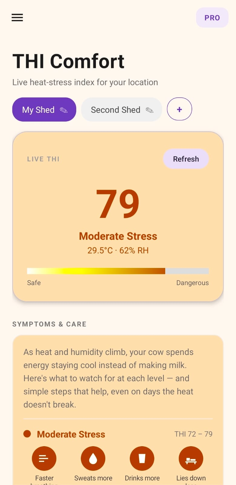
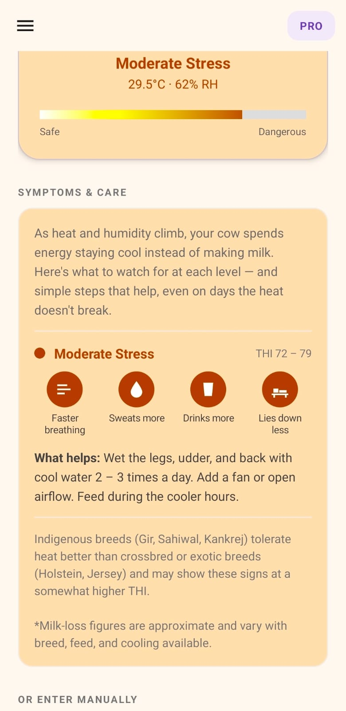
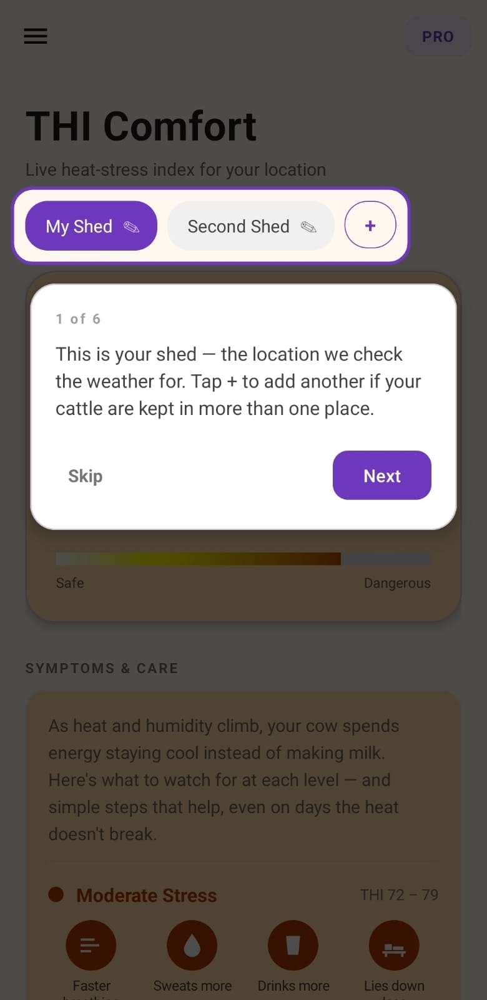

# THI Comfort

**Heat-stress early warning for dairy cattle — in every farmer's pocket.**

Heat stress costs dairy farmers money long before it's visible. Cattle eat less, produce less milk, and in severe cases face real health risk. The metric that quantifies it — the Temperature–Humidity Index (THI) — is standard in commercial dairy science, but the tools that measure it are built for large operations with sensor hardware budgets.

THI Comfort puts the same calculation on a smartphone, using live weather data, at zero hardware cost.

**Live on Google Play:** [play.google.com/store/apps/details?id=com.bhavyashukla.thitracker](https://play.google.com/store/apps/details?id=com.bhavyashukla.thitracker)

---

## Screenshots

| Live reading | Severity guidance |
|---|---|
|  |  |

| 7-day trends | First-run guided tour |
|---|---|
|  |  |

---

## What it does

- **Live THI monitoring** — calculates heat-stress index from current weather at the user's exact location, automatically.
- **Five severity tiers** — from Comfort to Danger, each with specific, practical guidance rather than just a number.
- **Multi-shed tracking** — farmers with cattle in more than one location track each independently, with its own location, history and readings.
- **Background alerts** — WorkManager-driven monitoring notifies the user when conditions turn dangerous, even when the app is closed.
- **Manual entry** — for users with their own thermometer readings, or without connectivity.
- **7-day trends** — history charting so patterns are visible, not just the current moment.
- **Fully trilingual** — English, Hindi and Gujarati, as a first-class native experience rather than translated labels.
- **Freemium subscriptions** — Google Play Billing with a 14-day trial; AdMob banners on the free tier.
- **In-app updates** — flexible Play update flow, so users aren't stranded on stale builds.

---

## Tech stack

| Area | Choice |
|---|---|
| Language | Kotlin |
| Platform | Android, minSdk 30, targetSdk 36 |
| Networking | Retrofit 2 + Gson, OpenWeatherMap API |
| Monetisation | Google Play Billing 8.3.0, Google AdMob |
| Background work | WorkManager |
| Updates | Play In-App Updates (flexible) |
| Charting | MPAndroidChart |
| Location | FusedLocationProviderClient |

---

## Architecture

Deliberately simple and dependency-light: Activity-based, no Compose, no ViewModel layer, no backend.

- **`BaseActivity`** — single inheritance point for every screen. Handles per-app locale via `LocaleHelper` and window-inset padding for edge-to-edge display, so both concerns are solved once rather than per-screen.
- **Singleton stores backed by `SharedPreferences`** — `ShedStore`, `EntitlementStore`, `ThiHistoryStore`, `TrialStore`, `LocationCache`. Each owns its own persistence and exposes a small CRUD surface.
- **`ThiComfortApplication`** — startup initialisation, locks the app to light mode.
- **Shared renderers** — e.g. `SymptomChipRenderer` is used identically by the main screen and the reference screen, so the two cannot visually drift apart.

No backend by design. Everything the app needs lives on the device or comes from the weather API, which keeps it usable on poor rural connectivity and removes an entire class of operational cost.

---

## Engineering notes

A few problems from this project that were more interesting than they first looked.

**Billing callbacks on the wrong thread.** Google Play Billing delivers its callbacks off the main thread. Mutating views directly from them threw `ViewRootImpl$CalledFromWrongThreadException` — but the exception was being swallowed, so the symptom was simply a purchase that appeared to do nothing. Diagnosed from Logcat rather than guessed at, and fixed by marshalling UI work back through `runOnUiThread`.

**Play's language splitting silently broke localisation.** Android App Bundles split resources per device by default, including language resources. The Hindi and Gujarati strings were complete and correct in source, present in the bundle, and still unavailable at runtime for most users. Resolved with `bundle { language { enableSplit = false } }`.

**Forced edge-to-edge under targetSdk 36.** Android 15+ enforces edge-to-edge with no opt-out, so app content drew underneath the status and navigation bars. Reported by a tester during closed testing. Rather than patching each layout, the fix reads real `WindowInsets` values and applies them as padding once in `BaseActivity` — so it self-corrects across notches, gesture vs button navigation, rotation and split-screen, and covers every screen at once. The same fix caught a second problem: the AdMob banner pinned to the bottom edge was being partially covered by the navigation bar, which is an ad-viewability issue as well as a visual one.

**Reinstall and subscription state.** Without a backend there's no server-side source of truth for an existing subscriber's billing period after a reinstall. Handled with backup rules plus a graceful timeout fallback, with an explicit acknowledgement that full correctness would require server state this app deliberately doesn't have.

**Onboarding that existing users would never see.** The first-run guided tour had to reach people who already had the app installed — the ones who'd asked for it. Reusing the existing onboarding flag would have shown it only to new installs, since that flag was already set on every existing device. It uses its own preference key for exactly that reason.

---

## Status

**Live on Google Play**, released September 2026.

Validated through a 14-day closed test with 12 testers — practising veterinary and farm-health professionals, i.e. the app's actual target users. The edge-to-edge rendering bug above was found and fixed during that test.

---

## Contact

Feedback and questions: workspacematrix.bhavya@gmail.com

Source code is kept in a private repository. Happy to walk through any part of it on request.
