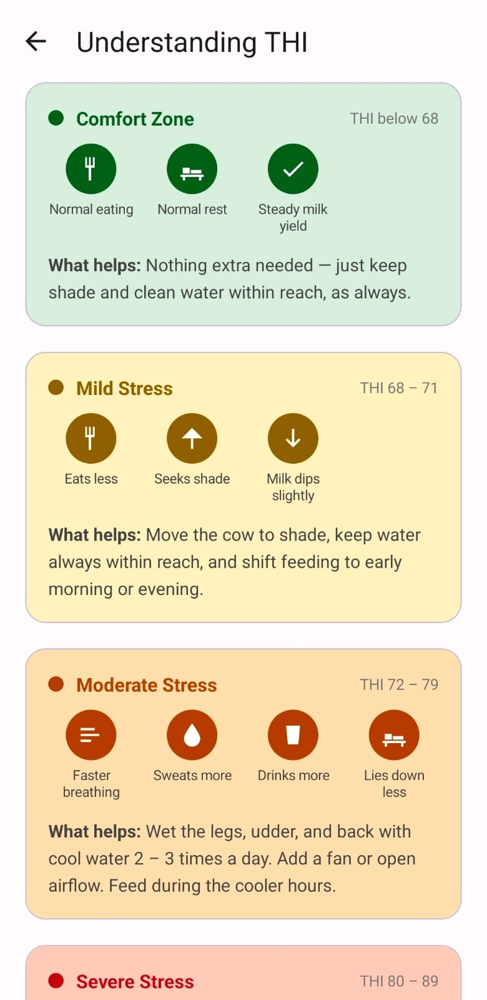
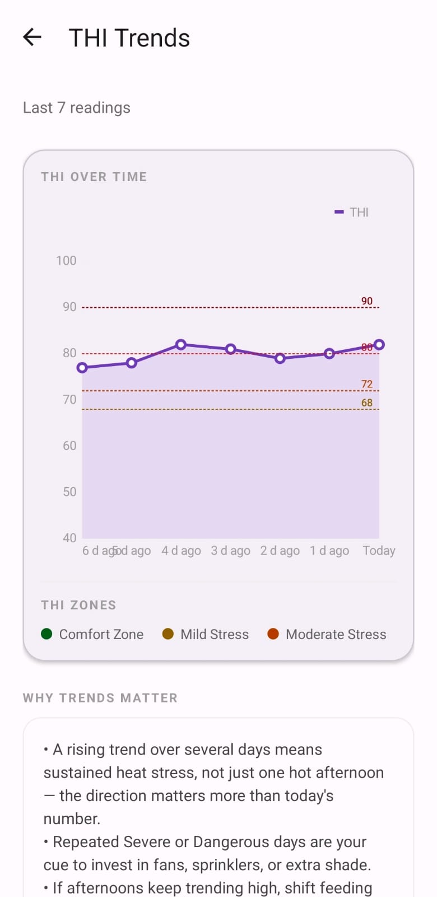
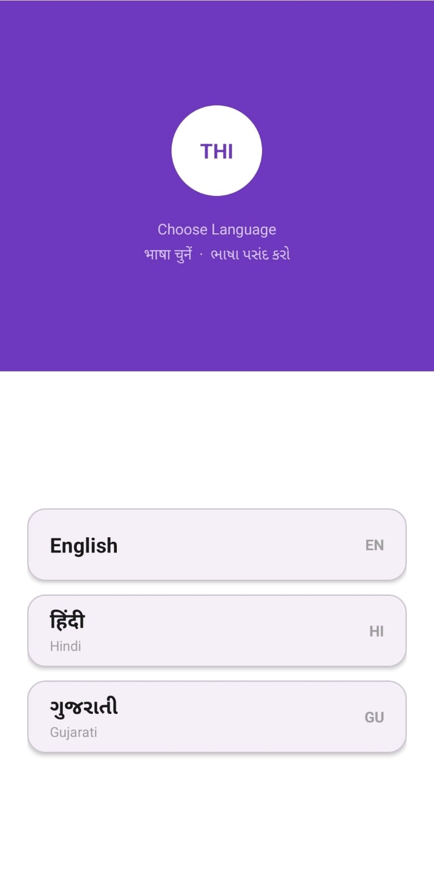

# THI Comfort

**Heat-stress early warning for dairy cattle — in every farmer's pocket.**

---

Heat stress costs dairy farmers money long before it's visible. Cattle eat less, produce less milk, and in severe cases face real health risk. The metric that quantifies it — the Temperature–Humidity Index — is standard in commercial dairy science, but the tools that measure it are built for large operations with sensor hardware budgets.

**THI Comfort puts the same calculation on a smartphone, using live weather data, at zero hardware cost.**

Built for small and mid-sized dairy farmers in India, in English, Hindi and Gujarati.

---

## Screenshots

| Live reading | Severity guidance | 7-day trends |
|:---:|:---:|:---:|
|  |  |  |

| First-run guided tour | Language selection |
|:---:|:---:|
|  |  |

---

## What it does

- **Live THI monitoring** — heat-stress index calculated from current weather at the user's exact location, automatically
- **Five severity tiers** — from Comfort to Danger, each with specific guidance rather than just a number
- **Multi-shed tracking** — cattle in more than one location, each with its own reading and history
- **Background alerts** — WorkManager monitoring warns of dangerous conditions even when the app is closed
- **Manual entry** — for users with their own thermometer, or without connectivity
- **7-day trends** — history charting, so patterns are visible and not just today's number
- **Breed-aware guidance** — indigenous breeds tolerate heat differently to crossbred and exotic ones, and the advice says so
- **Fully trilingual** — English, Hindi and Gujarati as first-class experiences, not translated labels
- **Freemium subscriptions** — Play Billing with a 14-day trial; AdMob banners on the free tier
- **In-app updates** — flexible Play update flow, so nobody is stranded on a stale build

---

## Tech stack

| Area | Choice |
|---|---|
| Language | Kotlin |
| Platform | Android — minSdk 30, targetSdk 36 |
| Networking | Retrofit 2 + Gson, OpenWeatherMap API |
| Monetisation | Google Play Billing 8.3.0, Google AdMob |
| Background work | WorkManager |
| Updates | Play In-App Updates (flexible) |
| Charting | MPAndroidChart |
| Location | FusedLocationProviderClient + geocoding autocomplete |

Single module. No Compose, no ViewModel layer, no DI framework, no backend — each a deliberate choice, with the reasoning in [Architecture](docs/ARCHITECTURE.md).

---

## Documentation

| Document | What's in it |
|---|---|
| **[Architecture](docs/ARCHITECTURE.md)** | Screen map, state layer, reading pipeline, and what was deliberately left out |
| **[Engineering notes](docs/ENGINEERING-NOTES.md)** | Six real bugs, how each was actually diagnosed, and why they were interesting |
| **[Product](docs/PRODUCT.md)** | The problem, the THI scale, who this is for, and the decisions that follow from that |
| **[Shipping](docs/SHIPPING.md)** | Play App Signing, the 12-testers/14-days requirement, production access, India's RBI PA-CB regulations |

---

## A sample of the engineering

Three from [the full write-up](docs/ENGINEERING-NOTES.md):

**A purchase that appeared to do nothing.** Play Billing delivers callbacks off the main thread. The callback mutated views directly, Android threw `ViewRootImpl$CalledFromWrongThreadException`, and the exception was swallowed inside the library — so the only symptom was a purchase that silently changed nothing. Found in Logcat, not by guessing.

**Localisation that was complete, correct, and unavailable.** Hindi and Gujarati strings were fully translated and present in the bundle, and most users still saw English. App Bundles split language resources per device by default, so an in-app language picker had nothing to switch to. One line in the Gradle config, invisible from anywhere in the source.

**Onboarding that would have missed everyone who asked for it.** Testers wanted the multi-shed concept explained. Adding it to the existing onboarding flow would have shown it only to new installs — because the onboarding flag was already set on every device belonging to the people who'd raised the feedback.

---

## Status

**Live on Google Play**, released September 2026.

Validated through a 14-day closed test with 12 testers — practising veterinary and farm-health professionals, the app's actual target users. The edge-to-edge rendering bug documented in the engineering notes was found and fixed during that test.

---

## Contact

**Bhavya Shukla** — workspacematrix.bhavya@gmail.com

Source is kept private. Happy to walk through any part of it on request.
