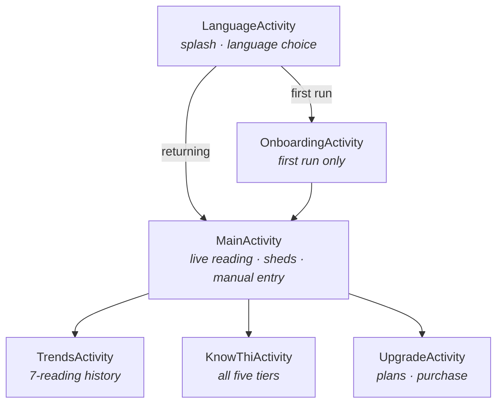
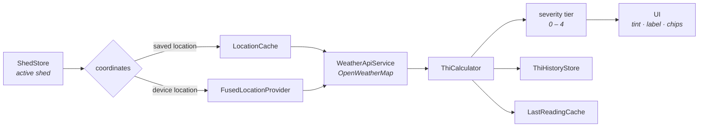

# Architecture

A single-module Android app in Kotlin, deliberately built without Compose, without a ViewModel layer, without a dependency-injection framework, and without a backend. Each of those is a choice rather than an omission, and the reasoning is at the bottom of this page.

---

## Screen map

Six activities, all extending a common `BaseActivity`:

| Activity | Role |
|---|---|
| `LanguageActivity` | Launch entry. Hosts the splash screen and the first-run language choice (English / Hindi / Gujarati). |
| `OnboardingActivity` | One-time introduction; starts the free trial. |
| `MainActivity` | The core screen — live THI reading, severity guidance, shed switcher, manual entry, and the first-run guided tour. |
| `TrendsActivity` | Seven-reading history chart with threshold lines. |
| `KnowThiActivity` | Static reference for all five severity tiers. |
| `UpgradeActivity` | Subscription plans, purchase flow, and subscribed-state management. |



---

## `BaseActivity`

Every activity inherits from it, which makes it the right place for concerns that would otherwise be duplicated six times and drift:

- **Per-app locale.** `attachBaseContext` routes through `LocaleHelper`, so a language chosen on first run applies to every screen without each one knowing about it.
- **Window insets.** The app targets SDK 36, where Android enforces edge-to-edge display with no opt-out. `BaseActivity` reads real `WindowInsets` values and applies them as padding to the content root, so content never draws under the status or navigation bars. Because it reads live values rather than hardcoding a height, it self-corrects across notches, gesture vs. three-button navigation, rotation, and split-screen.
- **Status bar appearance.** The app is locked to light mode, so status bar icons are explicitly set dark — without this, padding the bar area correctly would still leave unreadable light-on-light icons.

`ThiComfortApplication` handles process-level startup and pins the app to `MODE_NIGHT_NO`.

---

## State layer

There is no database and no ORM. State lives in small singleton objects, each owning its own `SharedPreferences` access and exposing a narrow API:

| Store | Responsibility |
|---|---|
| `ShedStore` | CRUD for tracked locations. Auto-creates a default shed on first access; refuses to delete the last remaining one; cleans up dependent caches on removal. |
| `ThiHistoryStore` | Rolling reading history per shed, capped to the most recent entries. |
| `EntitlementStore` | Subscription tier, auto-renewing state, and the fallback timers used when billing state is unknown. |
| `TrialStore` | Free-trial start and expiry. |
| `LocationCache` | Last known coordinates per shed. |
| `LastReadingCache` | Most recent reading per shed, so the UI has something to show before the network returns. |

Keeping these as separate objects rather than one god-store means a screen touches only the state it actually needs, and deleting a shed can clean up its dependents explicitly rather than by convention.

---

## Reading pipeline

1. `MainActivity` resolves the active shed from `ShedStore`.
2. Coordinates come from `LocationCache`, or from `FusedLocationProviderClient` for the device's own location.
3. `WeatherApiService` (Retrofit + Gson) fetches current conditions from OpenWeatherMap.
4. `ThiCalculator` converts temperature and relative humidity into an index:

   ```kotlin
   (0.8 * tempC + rh * (tempC - 14.4) + 46.4).roundToInt()
   ```

5. The result maps to one of five tiers, which drives the background tint, the card colours, the severity label, and the symptom chips shown.
6. The reading is written to `ThiHistoryStore` and `LastReadingCache`.



Adding a shed uses `GeocodingApiService` behind a debounced autocomplete. Typing alone never selects a place — the user must tap a suggestion, which removes an entire class of "wrong location silently chosen" bugs that a blind single-result geocode would produce.

---

## Shared rendering

`SymptomChips` holds the tier-to-symptom mapping, and `SymptomChipRenderer` renders it. Both `MainActivity` (for the current live tier) and `KnowThiActivity` (for all five tiers) call the same renderer.

This exists specifically so the two screens cannot drift apart. Duplicating the chip layout would guarantee that a change to one is eventually forgotten in the other.

---

## Background work

`DailyThiWorker` (WorkManager) performs periodic checks so the app can warn a user whose phone is in their pocket. Notifications fire only above a severity threshold and are rate-limited, so a hot week doesn't produce a stream of identical alerts.

---

## Billing

`BillingManager` wraps Google Play Billing. Notable details:

- Play delivers billing callbacks **off the main thread**, so all UI work is marshalled back explicitly. Getting this wrong produced one of the more interesting bugs in the project — see [Engineering notes](ENGINEERING-NOTES.md).
- Entitlement changes and offer changes are separate callbacks, so a screen can react to "the user is now Pro" without re-rendering the plan list.
- A one-time flag prevents the available-offers announcement from firing repeatedly.

`InAppUpdateManager` wraps Play In-App Updates in flexible mode — the update downloads in the background and prompts for a restart, rather than blocking the app. That choice is deliberate: users are often on poor rural connectivity, where a blocking update screen would make the app unusable exactly when someone needs a reading.

---

## Localisation

Three complete string sets — `values/`, `values-hi/`, `values-gu/` — kept in strict parity. Language is chosen on first run and applied through `LocaleHelper`, not left to the system locale, because a farmer's phone may be set to English while they'd rather read Gujarati.

The app bundle disables per-language resource splitting:

```kotlin
bundle { language { enableSplit = false } }
```

Without this, Play strips languages the device isn't currently set to — which silently broke Hindi and Gujarati despite the strings being complete and present in the bundle.

---

## What was deliberately left out

**No backend.** Everything lives on the device or comes from the weather API. This keeps the app usable on poor connectivity, removes hosting cost, and eliminates a whole category of operational failure. The honest cost is that subscription state can't be authoritatively restored after a reinstall — handled with backup rules and a graceful fallback, but not perfectly solvable without server state.

**No Compose.** The app was started on the View system, and a mid-project migration would have consumed time better spent on the localisation and billing work that users actually feel.

**No ViewModel layer.** With screens this size and state this simple, an architecture layer would have added indirection without removing complexity.

**No DI framework.** Six activities and a handful of singletons don't justify one.

Each of these is defensible at this size and would become wrong at a larger one. The trigger for revisiting them would be a second developer, a backend, or screens complex enough that state survives configuration changes badly.
